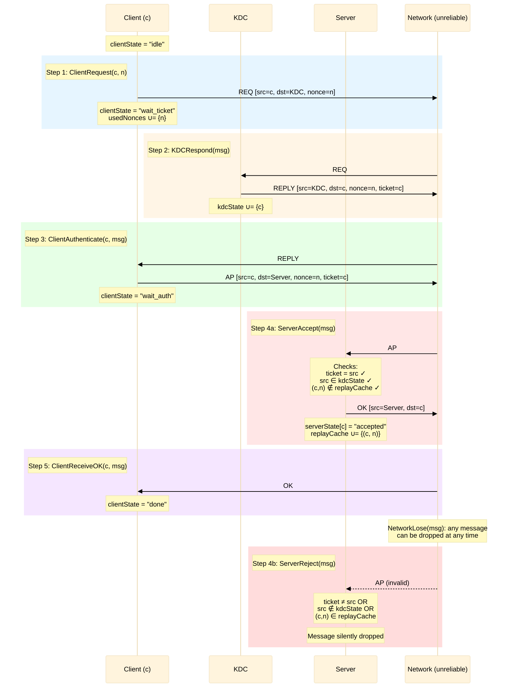
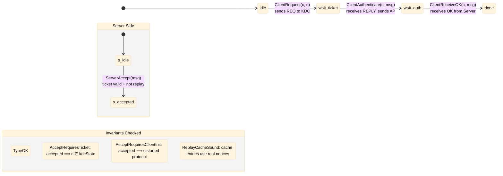

# Lab1a: Kerberos Authentication Protocol (Concrete)

## What is this?

This is a TLA+ specification of a simplified **Kerberos-style authentication protocol**. A client that wants to access a server must first obtain an **authentication ticket** from a trusted third party — the **KDC** (Key Distribution Center). The client then presents this ticket along with a fresh **authenticator** (containing a nonce) to the server. The server validates the ticket and checks its **replay cache** to prevent the same authenticator from being accepted twice.

The network is modeled as **unreliable**: messages can be lost or delivered in any order. Despite this, the specification guarantees that the server never accepts a client without a valid KDC-issued ticket.

TLC exhaustively explores every reachable state and checks that all safety invariants hold.

## Components

| Component | Role |
|---|---|
| **Client** (c1, c2, c3) | Initiates authentication, sends requests, presents tickets |
| **KDC** | Trusted authority that issues authentication tickets |
| **Server** | Validates tickets and authenticators, maintains a replay cache |
| **Network** | Unreliable message channel — delivers, reorders, or drops messages |

## How It Works (Step by Step)

**Protocol steps:**
1. **ClientRequest** — Client generates a fresh nonce and sends a `REQ` message to the KDC, requesting a ticket for the target server.
2. **KDCRespond** — KDC receives the request, records the client in its issued-tickets set (`kdcState`), and replies with a `REPLY` containing the ticket and the nonce.
3. **ClientAuthenticate** — Client receives the reply, constructs an `AP` (authentication) message containing the ticket and the nonce (acting as the authenticator), and sends it to the server.
4. **ServerAccept / ServerReject** — Server validates: (a) ticket identity matches the sender, (b) the KDC actually issued this ticket, (c) the `(client, nonce)` pair is not in the replay cache. If valid — accepts and sends `OK`. If any check fails — silently drops the message.
5. **ClientReceiveOK** — Client receives acknowledgment and transitions to `done`.

At any point, **NetworkLose** can drop any in-flight message, modeling packet loss and network failures.

## Client Lifecycle

Each client goes through these states, one at a time, never going backwards:

## Safety Invariants

TLC checks these invariants hold in **every reachable state**, across all possible interleavings and message losses:

| Invariant | Meaning |
|---|---|
| **TypeOK** | All variables remain within their declared types (no invalid state) |
| **AcceptRequiresTicket** | Server accepts client `c` only if `c ∈ kdcState` (KDC issued a ticket) |
| **AcceptRequiresClientInit** | Server accepts client `c` only if `c` has progressed past the initial request (no authentication without initiation) |
| **ReplayCacheSound** | Every entry in the replay cache corresponds to a nonce that was actually generated by a client |

## Liveness Properties

Checked under a **fair network** (no permanent message loss, weak fairness on all protocol actions):

| Property | Meaning |
|---|---|
| **EventuallyAuthenticated** | Every client eventually reaches the `done` state |

Liveness is verified separately using `SpecLive` (defined in `KerberosLive.tla`), which excludes `NetworkLose` and adds weak fairness constraints.

## Files

| File | Purpose |
|---|---|
| `Kerberos.tla` | Main specification — protocol + invariants + properties |
| `Kerberos.cfg` | TLC config for safety checking (with unreliable network) |
| `KerberosLive.tla` | Wrapper for liveness checking |
| `KerberosLive.cfg` | TLC config for liveness (fair network, no message loss) |
