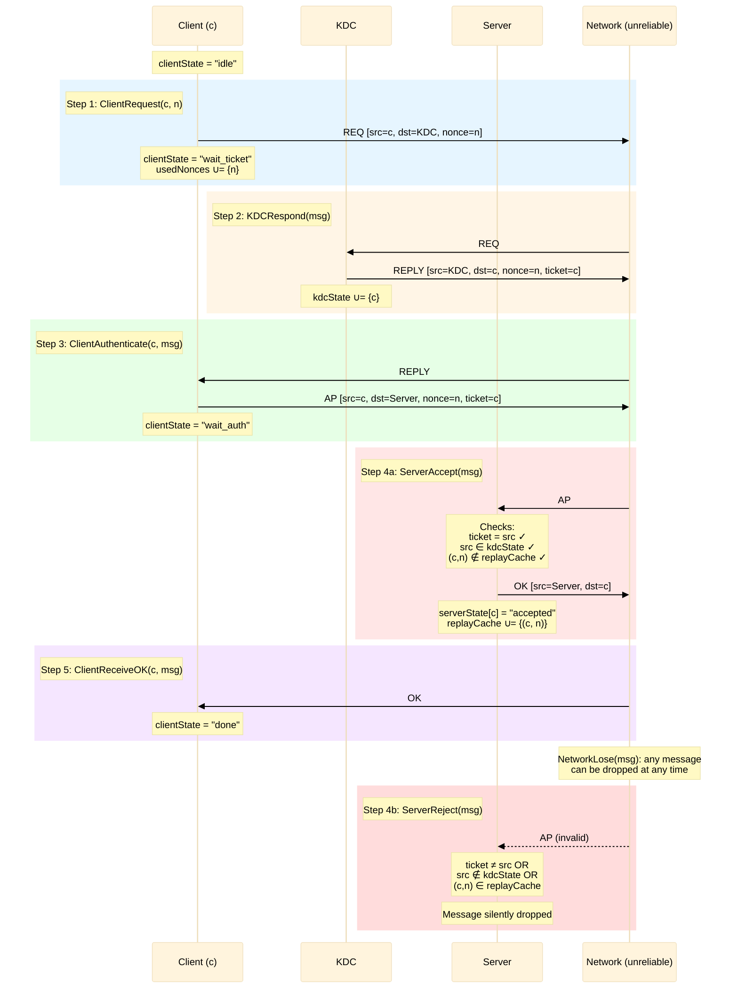
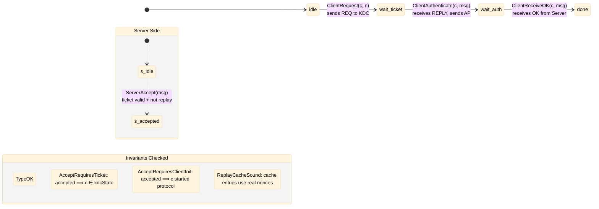

# Lab1a: Kerberos Concrete Protocol

## Protocol Sequence

```mermaid
%%{init: {'theme': 'base', 'themeVariables': {'primaryTextColor': '#000000', 'noteBkgColor': '#fff9c4', 'noteTextColor': '#000000', 'actorTextColor': '#000000', 'signalTextColor': '#000000', 'labelTextColor': '#000000'}}}%%
sequenceDiagram
    participant C as Client (c)
    participant KDC as KDC
    participant S as Server
    participant N as Network (unreliable)

    Note over C: clientState = "idle"
    
    rect rgb(230, 245, 255)
        Note left of C: Step 1: ClientRequest(c, n)
        C->>N: REQ [src=c, dst=KDC, nonce=n]
        Note over C: clientState = "wait_ticket"<br/>usedNonces ∪= {n}
    end

    rect rgb(255, 245, 230)
        Note left of KDC: Step 2: KDCRespond(msg)
        N->>KDC: REQ
        KDC->>N: REPLY [src=KDC, dst=c, nonce=n, ticket=c]
        Note over KDC: kdcState ∪= {c}
    end

    rect rgb(230, 255, 230)
        Note left of C: Step 3: ClientAuthenticate(c, msg)
        N->>C: REPLY
        C->>N: AP [src=c, dst=Server, nonce=n, ticket=c]
        Note over C: clientState = "wait_auth"
    end

    rect rgb(255, 230, 230)
        Note left of S: Step 4a: ServerAccept(msg)
        N->>S: AP
        Note over S: Checks:<br/>ticket = src ✓<br/>src ∈ kdcState ✓<br/>(c,n) ∉ replayCache ✓
        S->>N: OK [src=Server, dst=c]
        Note over S: serverState[c] = "accepted"<br/>replayCache ∪= {(c, n)}
    end

    rect rgb(245, 230, 255)
        Note left of C: Step 5: ClientReceiveOK(c, msg)
        N->>C: OK
        Note over C: clientState = "done"
    end

    Note over N: NetworkLose(msg): any message<br/>can be dropped at any time

    rect rgb(255, 220, 220)
        Note left of S: Step 4b: ServerReject(msg)
        N-->>S: AP (invalid)
        Note over S: ticket ≠ src OR<br/>src ∉ kdcState OR<br/>(c,n) ∈ replayCache
        Note over S: Message silently dropped
    end
```

## Client State Machine + Invariants

```mermaid
%%{init: {'theme': 'base', 'themeVariables': {'primaryTextColor': '#000000', 'lineColor': '#333333'}}}%%
stateDiagram-v2
    direction LR
    [*] --> idle
    idle --> wait_ticket : ClientRequest(c, n)<br/>sends REQ to KDC
    wait_ticket --> wait_auth : ClientAuthenticate(c, msg)<br/>receives REPLY, sends AP
    wait_auth --> done : ClientReceiveOK(c, msg)<br/>receives OK from Server

    state "Server Side" as server {
        [*] --> s_idle
        s_idle --> s_accepted : ServerAccept(msg)<br/>ticket valid + not replay
    }

    state "Invariants Checked" as inv {
        state "TypeOK" as t1
        state "AcceptRequiresTicket: accepted ⟹ c ∈ kdcState" as t2
        state "AcceptRequiresClientInit: accepted ⟹ c started protocol" as t3
        state "ReplayCacheSound: cache entries use real nonces" as t4
    }
```
