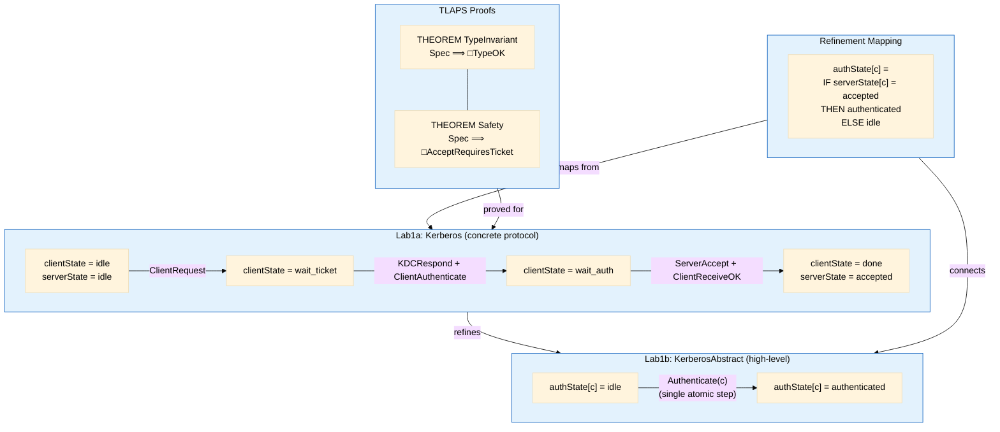

# Lab1b: Abstraction, Refinement & TLAPS Proofs

## Overview



## Refinement Mapping

The concrete Kerberos protocol (with messages, KDC, replay cache) **refines** the abstract specification where authentication is a single atomic step:

| Concrete (Lab1a) | Abstract (Lab1b) |
|---|---|
| `serverState[c] = "accepted"` | `authState[c] = "authenticated"` |
| `serverState[c] = "idle"` | `authState[c] = "idle"` |
| 6 variables, 7 actions, messages | 1 variable, 1 action, no messages |

## TLAPS Proof Structure

Both proofs follow the standard inductive invariant pattern, decomposed per action:

```
THEOREM: Spec ⟹ □Invariant
  <1>1. Init ⟹ Invariant                    (base case)
  <1>2. Invariant ∧ [Next]_vars ⟹ Invariant' (inductive step)
    <2>2. CASE ClientRequest      — preserves invariant
    <2>3. CASE KDCRespond         — preserves invariant
    <2>4. CASE ClientAuthenticate — preserves invariant
    <2>5. CASE ServerAccept       — KEY: src ∈ kdcState precondition
    <2>6. CASE ServerReject       — no state change
    <2>7. CASE ClientReceiveOK    — preserves invariant
    <2>8. CASE NetworkLose        — preserves invariant
    <2>9. CASE UNCHANGED vars     — stutter step
  <1>q. QED BY <1>1, <1>2, PTL
```
