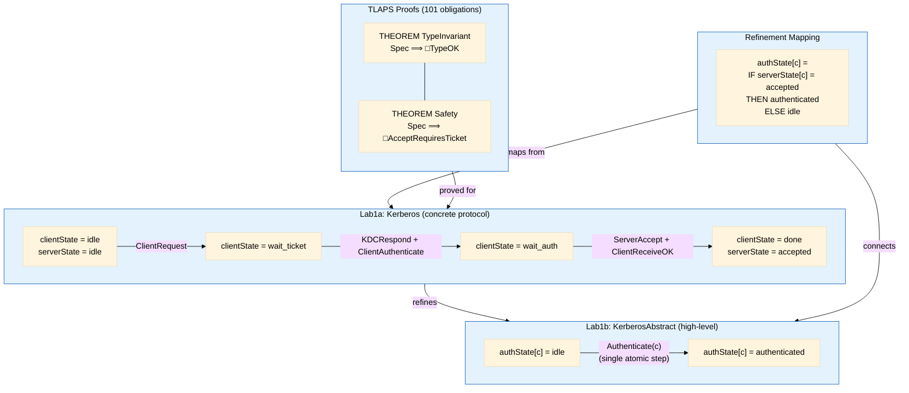

# Lab1b: Abstract Specification, Refinement & Proof

## The Idea

In Lab1a, I modeled the Kerberos protocol with all its details — message exchanges between client, KDC, and server, ticket validation, replay cache lookups, and unreliable network behavior.

But at a higher abstraction level, the entire protocol achieves one thing: **a client transitions from unauthenticated to authenticated**. The abstract specification captures this essential behavior in a single atomic action, without any messages, tickets, or network.

The core question: **does the concrete multi-step protocol correctly implement this abstract one-step behavior?** This is **refinement** — showing that every behavior of the concrete system is a valid behavior of the abstract system.

## Two Abstraction Levels

- **Abstract** (`KerberosAbstract.tla`): One variable `authState[c] ∈ {idle, authenticated}`, one action `Authenticate(c)`. No messages, no KDC, no network.
- **Concrete** (`Kerberos.tla` from Lab1a): Six variables, seven actions, four message types (`REQ`, `REPLY`, `AP`, `OK`), unreliable network with message loss.

Both specifications describe the same system at different levels of detail.

## How They Relate



## Refinement Mapping

The refinement mapping defines how concrete state variables map to abstract ones:

```
authState[c] == IF serverState[c] = "accepted" THEN "authenticated" ELSE "idle"
```

This single expression bridges the 6-variable concrete world to the 1-variable abstract world: a client is considered "authenticated" in the abstract sense precisely when the server has accepted them in the concrete protocol.

| Concrete (Lab1a) | Abstract (Lab1b) |
|---|---|
| `serverState[c] = "accepted"` | `authState[c] = "authenticated"` |
| `serverState[c] = "idle"` | `authState[c] = "idle"` |
| 6 variables, 7 actions, 4 message types | 1 variable, 1 action, no messages |

TLC verifies refinement by running the concrete spec with 3 clients (`c1`, `c2`, `c3`) and 3 nonces, checking at every reachable state that the mapped abstract variables satisfy the abstract spec's transition relation. The model explores 15,391 states (5,212 distinct).

## TLAPS Proofs

While TLC verifies properties for a finite model (3 clients, 3 nonces), **TLAPS** provides a formal mathematical proof that holds for **arbitrary** constants — any number of clients and nonces. We prove two invariants with a total of **101 proof obligations**, all verified by the Z3 SMT solver:

### 1. TypeOK (type invariant)
All state variables stay within their declared domains throughout execution. This includes verifying that `network ⊆ Messages`, where `Messages` is the union of four record types (`REQ`, `REPLY`, `AP`, `OK`).

### 2. AcceptRequiresTicket (security invariant)
If `serverState[c] = "accepted"`, then `c ∈ kdcState`. The server never grants access to a client without a KDC-issued ticket.

### Proof technique

Both proofs use **inductive invariant reasoning**, decomposed per action. Each CASE step uses TLAPS's SMT backend (Z3) with a SUFFICES step that makes assumptions explicit:

```
THEOREM: LocalSpec ⟹ □Invariant
  <1>1. Init ⟹ Invariant                    (base case)
  <1>2. Invariant ∧ [Next]_vars ⟹ Invariant' (inductive step)
    <2>1. SUFFICES ASSUME Invariant, [Next]_vars PROVE Invariant'
    <2>2. CASE ClientRequest      BY <2>1, <2>2, SMT DEF ...
    <2>3. CASE KDCRespond         BY <2>1, <2>3, SMT DEF ...
    <2>4. CASE ClientAuthenticate BY <2>1, <2>4, SMT DEF ...
    <2>5. CASE ServerAccept       — KEY: src ∈ kdcState precondition
    <2>6. CASE ServerReject       — no state change
    <2>7. CASE ClientReceiveOK    BY <2>1, <2>7, SMT DEF ...
    <2>8. CASE NetworkLose        BY <2>1, <2>8, SMT DEF ...
    <2>9. CASE UNCHANGED vars     — stutter step
  <1>q. QED BY <1>1, <1>2, PTL
```

The critical case is **ServerAccept** (step `<2>5`): it sets `serverState[c] = "accepted"` but only when `msg.src ∈ kdcState` — so the invariant is preserved by construction.

### Why local definitions?

TLAPS backends (Z3, Zenon) cannot reason through TLA+ `INSTANCE` indirection. `KerberosRefinement.tla` therefore contains local copies of all Kerberos definitions (`Messages`, `TypeOK`, `Init`, all 7 actions, `Next`, `AcceptRequiresTicket`) and proves invariants over a `LocalSpec`. Two bridge theorems then transfer the results to `K!Spec` by expanding both sides:

```
THEOREM TypeInvariant == K!Spec => []TypeOK
    BY TypeInvariantLocal DEF LocalSpec, K!Spec, K!Init, K!Next, ...
```

## Running

```bash
make check-abstract      # TLC: check abstract spec (2 clients)
make check-refinement    # TLC: check refinement mapping (3 clients, 3 nonces)
make check-proofs        # TLAPS: verify all 101 proof obligations
```

## Files

| File | Purpose |
|---|---|
| `KerberosAbstract.tla` | Abstract spec — one variable, one action |
| `KerberosAbstract.cfg` | TLC config for abstract spec (2 clients) |
| `KerberosRefinement.tla` | Refinement mapping, local definitions, TLAPS proofs (TypeOK + AcceptRequiresTicket), bridge theorems |
| `KerberosRefinement.cfg` | TLC config for refinement checking (3 clients, 3 nonces) |
| `Kerberos.tla` | Copy of Lab1a's concrete spec (needed for `INSTANCE` import) |
